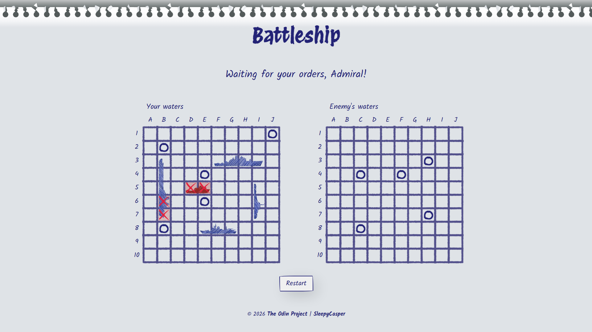

# 🚢 Battleship

A browser-based Battleship game with a hand-drawn, doodle-style visual aesthetic — built as part of [The Odin Project](https://www.theodinproject.com/) curriculum, with a focus on clean modular architecture, computer AI logic, and full session persistence (reload the page mid-game and pick up right where you left off).

## Preview



🔗 [Play it here](https://sleepycasper.github.io/odin-battleship/)

## Features

- **Ship placement UI** — drag-and-drop-free placement with click-to-place, rotate axis with a button or the `R` key, and live valid/invalid hover previews
- **Computer opponent AI** — random hunting with intelligent target-queueing once a hit lands, including axis detection to chase down ships in a line
- **Session persistence** — game state (ship placements, attacks, turn order, computer's hunting state) is saved to `sessionStorage`, so a page reload restores the game exactly as it was
- **Hand-drawn visual style** — custom SVG filters for sketchy borders and hit/miss markers
- **Smooth animations** — staggered status bar updates, crossfade ship reveals, and animated hit/sink markers

## Built With

- **JavaScript (ES Modules)** — vanilla JS, no framework
- **Webpack** — module bundling for the browser
- **SCSS / CSS Grid** — layout and styling
- **SVG & SVG Filters** — hand-drawn visual effects
- **Jest** — unit testing

## Architecture

The codebase is split by responsibility, with each module owning a single concern:

| Module         | Responsibility                                                                     |
| -------------- | ---------------------------------------------------------------------------------- |
| `game.js`      | Core game flow, turn management                                                    |
| `gameboard.js` | Board state, ship placement, attack resolution                                     |
| `ship.js`      | Ship class (hits, sunk state)                                                      |
| `player.js`    | Human and Computer player classes, computer AI decision-making                     |
| `events.js`    | Sole orchestration layer — wires up UI events and drives game/render/storage calls |
| `render.js`    | All DOM rendering and rendering state                                              |
| `elements.js`  | Centralized DOM element references                                                 |
| `storage.js`   | Sole module touching `sessionStorage`                                              |
| `utils.js`     | Shared helper functions                                                            |

## Getting Started

### Prerequisites

- [Node.js](https://nodejs.org/) (includes npm)

### Installation

1. Clone the repository
   ```bash
   git clone https://github.com/your-username/battleship.git
   cd battleship
   ```
2. Install dependencies
   ```bash
   npm install
   ```
3. Start the development server
   ```bash
   npm start
   ```
4. Open your browser to `http://localhost:8080` (or whatever port Webpack Dev Server reports)

### Running Tests

```bash
npm test
```

### Building for Production

```bash
npm run build
```

## How to Play

1. Enter your name and start a new game
2. Place your five ships on the board — click a ship in the list to select it, click a cell to place it, and toggle orientation with the rotate button or the `R` key
3. Once all ships are placed, hit **Start battle**
4. Take turns attacking the enemy's waters by clicking a cell — sink all enemy ships before they sink yours!

## License

This project is licensed under the [MIT License](LICENSE).

## Acknowledgments

- [The Odin Project](https://www.theodinproject.com/) for the project brief
- Ship and UI artwork exported with [Inkscape](https://inkscape.org/)

## Author

**SleepyCasper** — [GitHub](https://github.com/SleepyCasper)
